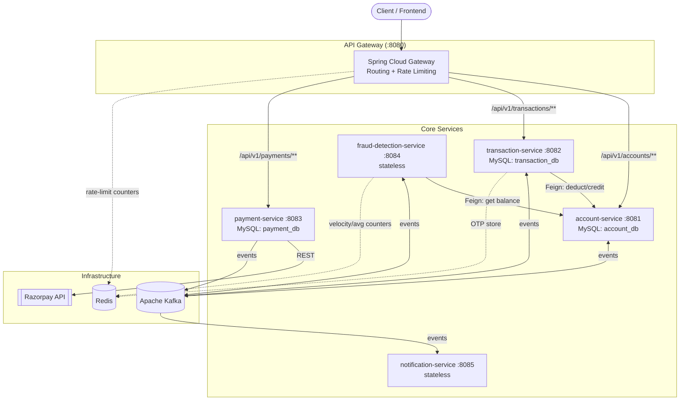
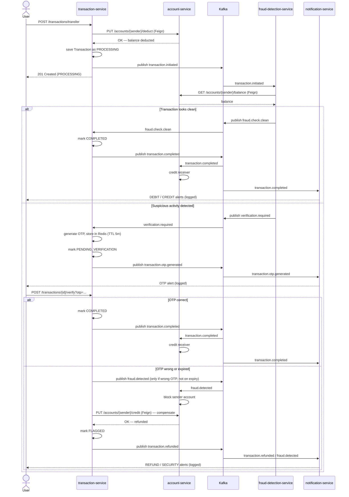

# Digital Banking System


A backend simulation of a digital bank built as a set of independent **Spring Boot microservices**. It supports account management, peer-to-peer fund transfers, third-party payment collection (Razorpay), real-time rule-based fraud detection, OTP step-up verification, and event-driven customer notifications — all coordinated asynchronously through **Apache Kafka** using the **SAGA (choreography) pattern** for distributed transactions.

---

## Table of Contents

1. [Architecture](#architecture)
2. [Services](#services)
3. [The Transfer Saga — How Money Actually Moves](#the-transfer-saga--how-money-actually-moves)
4. [Kafka Topics Reference](#kafka-topics-reference)
5. [Tech Stack](#tech-stack)
6. [Project Structure](#project-structure)

---

## Architecture

The system follows a **microservices + event-driven architecture**. Synchronous REST/Feign calls are used only where an immediate answer is required (e.g. "deduct this balance now"); everything else — fraud checks, notifications, status propagation — happens asynchronously over Kafka so that services stay decoupled and independently deployable.



## Services

| Service | Port | Datastore | Responsibility |
|---|---|---|---|
| **api-gateway** | 8080 | Redis (rate limiter) | Single entry point; routes requests to downstream services |
| **account-service** | 8081 | MySQL (`account_db`) | Owns account data and balances; exposes deduct/credit endpoints used inside the SAGA |
| **transaction-service** | 8082 | MySQL (`transaction_db`) + Redis (OTP) | Orchestrates transfers, drives the SAGA, handles OTP verification |
| **payment-service** | 8083 | MySQL (`payment_db`) | Creates Razorpay orders, handles Razorpay webhooks for deposits |
| **fraud-detection-service** | 8084 | Redis (counters) | Consumes every initiated transaction and scores it for fraud |
| **notification-service** | 8085 | — (stateless) | Consumes all customer-facing events and logs alerts (debit/credit/OTP/fraud/refund/payment) |

## The Transfer Saga — How Money Actually Moves

A transfer is not a single database transaction — it's a **choreographed SAGA** spread across `transaction-service`, `account-service`, and `fraud-detection-service`, coordinated entirely through Kafka events. This is the core design of the system, so it's worth walking through in full.



**Why the deduction happens before the fraud check:** the sender's balance is deducted synchronously up front (SAGA step 1) so the money is provisionally "in flight" and can't be double-spent while the asynchronous fraud check runs. If the fraud check or OTP step fails, `account-service`'s `credit` endpoint is invoked as the **compensating transaction** (SAGA step 4) to reverse the deduction — this is the same endpoint used for crediting the receiver on a successful transfer.

## Kafka Topics Reference

| Topic | Producer | Consumer(s) | Purpose |
|---|---|---|---|
| `transaction.initiated` | transaction-service | fraud-detection-service | New transfer needs a fraud check |
| `fraud.check.clean` | fraud-detection-service | transaction-service | Transaction passed all fraud checks |
| `verification.required` | fraud-detection-service | transaction-service | Transaction needs OTP step-up |
| `transaction.otp.generated` | transaction-service | notification-service | Deliver OTP to the user |
| `transaction.completed` | transaction-service | account-service, notification-service | Credit receiver; send debit/credit alerts |
| `transaction.refunded` | transaction-service | notification-service | SAGA compensation happened; notify sender |
| `fraud.detected` | transaction-service | account-service, notification-service | Block the account; alert the user |
| `payment.completed` | payment-service | notification-service | Razorpay deposit succeeded |
| `payment.failed` | payment-service | notification-service | Razorpay deposit failed |

## Tech Stack

- **Language / Runtime:** Java 17
- **Framework:** Spring Boot 4.1.1, Spring Cloud 2025.1.3
- **API Gateway:** Spring Cloud Gateway (WebFlux, reactive)
- **Persistence:** Spring Data JPA + MySQL (one schema per service — `account_db`, `transaction_db`, `payment_db`)
- **Messaging:** Apache Kafka (via Spring Kafka), event payloads as JSON
- **Caching / Ephemeral state:** Redis (OTP storage, fraud counters, gateway rate limiting)
- **Inter-service calls:** OpenFeign
- **Payments:** Razorpay Java SDK
- **Other:** Lombok, ModelMapper, Spring Validation, Spring Boot Actuator
- **Containerization:** Docker Compose (Redis, Zookeeper, Kafka)

## Project Structure

```
DigitalBankingSystem/
├── api-gateway/               # Routing + rate limiting (port 8080)
├── account-service/           # Accounts & balances (port 8081)
├── transaction-service/       # Transfer SAGA orchestration (port 8082)
├── payment-service/           # Razorpay integration (port 8083)
├── fraud-detection-service/   # Rule-based fraud engine (port 8084)
├── notification-service/      # Event-driven alerts (port 8085)
└── docker-compose.yml         # Redis + Kafka + Zookeeper
```

Each service is an independent Maven project (own `pom.xml`, `mvnw`) following the standard `controller → service → repository` layering, with `dto`, `entity`/`model`, `event`, and `client` (Feign) packages where relevant.
